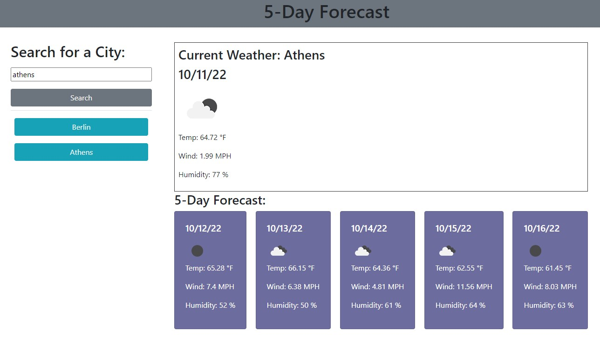

# 5-Day Weather Forecast
## Repo for Challenge #6 of the Bootcamp - Create a 5-Day Weather Forecast Application

### Decsription

For Challenge 6 of the bootcamp we were tasked with creating an application that shows the current weather and 5-day forecast for a given city. The user inputs a city name and the application searches for a city and displays weather data for temp, wind, and humidity from the OpenWeatherMap API on the page. This application uses APIs from OpenWeatherMap (geo, current weather, and 5-day forecast). The application also uses local storage to save user input and creates buttons in a list of previous searches. Users can click on these buttons to display the weather data for that city again.

### Installation

N/A

### Usage

[Link to deployed website](https://mjkonkel.github.io/weather-forecast/)

- Type the name of a city into the search bar
- The current weather for that city is displayed along with a 5-day forecast
- The name of that city is saved in a list so the user can easily show the weather info for that city again by clikcing on the button in the list

### License

Please refer to the license in the repo.
